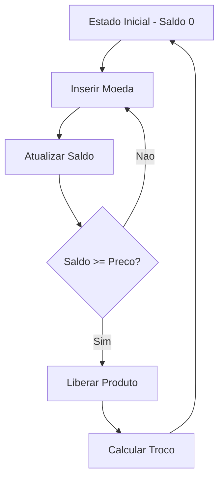

# 🍬 Máquina de Doces Inteligente

Simulação interativa de uma Vending Machine desenvolvida para a disciplina de Linguagens Formais e Autômatos, aplicando conceitos de Autômato Finito Determinístico (AFD) e Máquina de Mealy (Autômato com Saída) em uma interface web animada.

---

## 🎯 Objetivo

O projeto tem como finalidade modelar e implementar uma máquina de doces que:

- Aceita moedas específicas  
- Atualiza o saldo dinamicamente  
- Permite seleção de produtos por código  
- Libera o produto quando o valor é suficiente  
- Calcula e devolve troco automaticamente  
- Representa formalmente um Autômato Finito  

---

## 🧠 Fundamentação Teórica

A modelagem do sistema é baseada na definição formal de um autômato:

M = (Q, Σ, δ, q₀, F, Δ)

Onde:

- Q → Conjunto de estados (representados pelo saldo acumulado)  
- Σ → Inserção de moedas + seleção de código  
- δ → Função de transição (atualização do saldo)  
- q₀ → Estado inicial (saldo = 0)  
- F → Estados finais (compra validada)  
- Δ → Saída (produto liberado + troco)  

Cada inserção de moeda representa uma transição de estado.  
A compra representa um estado final com saída associada (produto + troco).

---

## 💰 Sistema de Moedas

A máquina aceita as seguintes moedas:

- R$ 1  
- R$ 2  
- R$ 10  
- R$ 20  
- R$ 50  

Cada moeda possui seu próprio arquivo PNG dentro da pasta `IMG`, sendo utilizada tanto visualmente quanto na lógica do sistema.

---

## 🍫 Produtos

Cada produto contém:

- Código identificador  
- Nome  
- Preço  
- Imagem  

A compra é liberada quando:

saldo >= preço do produto

Caso o saldo seja superior ao valor do produto, o sistema calcula e devolve o troco automaticamente.

---

## ⚙️ Funcionalidades Implementadas

- Inserção animada de moedas  
- Atualização dinâmica do visor  
- Validação de código  
- Liberação animada do produto na bandeja  
- Sistema automático de troco  
- Controle de jogadas  
- Efeito visual de vidro (Glassmorphism)  
- Organização do código seguindo princípios de Clean Code  

---

## 🛠 Tecnologias Utilizadas

    
 

---

## 📂 Estrutura do Projeto

📦 maquina-de-doces
 ┣ 📂 IMG
 ┃ ┣ moedas
 ┃ ┣ produtos
 ┣ 📜 index.html
 ┣ 📜 style.css
 ┣ 📜 script.js
 ┗ 📜 README.md  

---

## 🔄 Fluxo de Funcionamento

## 🚀 Como Executar

https://b3ery.github.io/MachineCandy/  

---

## 🏁 Conclusão

Este projeto demonstra a aplicação prática dos conceitos de Autômatos Finitos na modelagem de sistemas reais, integrando teoria da computação, lógica de programação e interface gráfica em uma solução interativa e funcional.
