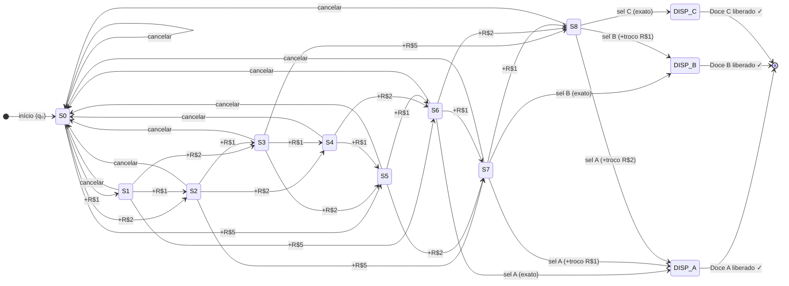

<div align="center">


</div>

<div align="center">

[](https://git.io/typing-svg)

</div>

<br>

<div align="center">

<a href="https://b3ery.github.io/MachineCandy/">
  
</a>

</div>

<br>

<div align="center">


</div>

<br>

---

## 👥 Nossa Equipe

<div align="center">

<sub>Disciplina: <b>Linguagens Formais e Autômatos</b> — Universidade São Judas Tadeu · 2025</sub>

<br><br>

<table>
  <tr>
    <td align="center" width="14%">
      <a href="https://github.com/atr3ssa">
        <br>
        <sub><b>Andressa Rabêlo</b></sub>
      </a><br>
      <sub>RA: 823213904</sub>
    </td>
    <td align="center" width="14%">
      <a href="https://github.com/Julia-Olive">
        <br>
        <sub><b>Júlia Oliveira</b></sub>
      </a><br>
      <sub>RA: 823214680</sub>
    </td>
    <td align="center" width="14%">
      <a href="https://github.com/Marzocca99">
        <br>
        <sub><b>Lucas Marzocca</b></sub>
      </a><br>
      <sub>RA: 823116813</sub>
    </td>
    <td align="center" width="14%">
      <a href="https://github.com/Elmarquitoos">
        <br>
        <sub><b>Marcos V. Santos</b></sub>
      </a><br>
      <sub>RA: 82327399</sub>
    </td>
    <td align="center" width="14%">
      <a href="https://github.com/matheushfg">
        <br>
        <sub><b>Matheus H. F.</b></sub>
      </a><br>
      <sub>RA: 823141914</sub>
    </td>
    <td align="center" width="14%">
      <a href="https://github.com/b3ery">
        <br>
        <sub><b>Mylena Soares</b></sub>
      </a><br>
      <sub>RA: 824144075</sub>
    </td>
  </tr>
</table>

</div>

<br>

---

## 🌃 Sobre o Projeto

> **Meow Candy** é uma animação interativa de uma **máquina de doces**, desenvolvida como trabalho prático da disciplina de **Linguagens Formais e Autômatos**. O sistema implementa um **Autômato Finito Determinístico (AFD)** completo — com estados, transições, alfabeto de entrada e estados de aceite — em uma interface web com estética **lo-fi noturna** roxa. Um gatinho roxo busca e entrega os doces. 🐱💜

<br>

<div align="center">

```
╔═══════════════════════════════════════════════════════════════════╗
║   🪙 Insira moeda   →   📺 Saldo atualiza   →   🔢 Escolha doce  ║
║          ↓                                           ↓            ║
║   🐱 Gato entrega   ←   💸 Troco calculado   ←   ✅ Compra OK    ║
╚═══════════════════════════════════════════════════════════════════╝
```

</div>

<br>

---

## 🧠 Fundamentação Teórica — O AFD

O sistema é modelado formalmente como:

$$M = (Q,\ \Sigma,\ \delta,\ q_0,\ F)$$

| Componente | Símbolo | Implementação no projeto |
|:---:|:---:|:---|
| **Estados** | $Q$ | `S0` a `S8+`, `DISP_A`, `DISP_B`, `DISP_C` — representam o saldo acumulado |
| **Alfabeto** | $\Sigma$ | Moedas R$1, R$2, R$5 · Seleção de doce (A/B/C) · Cancelar |
| **Transição** | $\delta$ | `δ(Sn, moeda) → S(n+valor)` · `δ(Sn, selX) → DISP_X` se saldo ≥ preço |
| **Estado Inicial** | $q_0$ | `S0` — saldo = R$0,00, aguardando pagamento |
| **Estados Finais** | $F$ | `DISP_A`, `DISP_B`, `DISP_C` — compra validada, doce + troco liberados |

<br>

### Tabela de Transições δ

<div align="center">

| Estado | +R$1 | +R$2 | +R$5 | sel A (R$6) | sel B (R$7) | sel C (R$8) | cancelar |
|:---:|:---:|:---:|:---:|:---:|:---:|:---:|:---:|
| **S0** | S1 | S2 | S5 | ✗ | ✗ | ✗ | S0 |
| **S1** | S2 | S3 | S6 | ✗ | ✗ | ✗ | S0 |
| **S2** | S3 | S4 | S7 | ✗ | ✗ | ✗ | S0 |
| **S3** | S4 | S5 | S8 | ✗ | ✗ | ✗ | S0 |
| **S4** | S5 | S6 | S8+ | ✗ | ✗ | ✗ | S0 |
| **S5** | S6 | S7 | S8+ | ✗ | ✗ | ✗ | S0 |
| **S6** | S7 | S8 | S8+ | **DISP_A** ✓ | ✗ | ✗ | S0 |
| **S7** | S8 | S8+ | S8+ | **DISP_A** ✓ | **DISP_B** ✓ | ✗ | S0 |
| **S8+** | S8+ | S8+ | S8+ | **DISP_A** ✓ | **DISP_B** ✓ | **DISP_C** ✓ | S0 |

</div>

> `✗` = transição inválida — saldo insuficiente (visor pisca)  
> `S8+` = saldo máximo acumulado (cap em R$15,00); troco devolvido na bandeja pelo algoritmo guloso

<br>

### 📊 Diagrama de Estados


```mermaid
stateDiagram-v2
    direction LR

    [*] --> S0 : início (q₀)

    S0 --> S1 : +R$1
    S0 --> S2 : +R$2
    S0 --> S5 : +R$5

    S1 --> S2 : +R$1
    S1 --> S3 : +R$2
    S1 --> S6 : +R$5

    S2 --> S3 : +R$1
    S2 --> S4 : +R$2
    S2 --> S7 : +R$5

    S3 --> S4 : +R$1
    S3 --> S5 : +R$2
    S3 --> S8 : +R$5

    S4 --> S5 : +R$1
    S4 --> S6 : +R$2

    S5 --> S6 : +R$1
    S5 --> S7 : +R$2

    S6 --> S7 : +R$1
    S6 --> S8 : +R$2

    S7 --> S8 : +R$1

    S6 --> DISP_A : sel A (exato)
    S7 --> DISP_A : sel A (+troco R$1)
    S7 --> DISP_B : sel B (exato)
    S8 --> DISP_A : sel A (+troco R$2)
    S8 --> DISP_B : sel B (+troco R$1)
    S8 --> DISP_C : sel C (exato)

    S0 --> S0 : cancelar
    S1 --> S0 : cancelar
    S2 --> S0 : cancelar
    S3 --> S0 : cancelar
    S4 --> S0 : cancelar
    S5 --> S0 : cancelar
    S6 --> S0 : cancelar
    S7 --> S0 : cancelar
    S8 --> S0 : cancelar

    DISP_A --> [*] : Doce A liberado ✓
    DISP_B --> [*] : Doce B liberado ✓
    DISP_C --> [*] : Doce C liberado ✓
```

> O diagrama gerado também está disponível como arquivo separado `.jpg` e `.pdf` neste repositório.

<br>

---

## 🍬 Especificação do Sistema

### Entradas aceitas — Alfabeto Σ

<div align="center">

| Símbolo | Descrição | Efeito no autômato |
|:---:|:---|:---|
| `MOEDA_1` | Moeda de R$ 1,00 | `saldo += 1` → avança estado |
| `MOEDA_2` | Moeda de R$ 2,00 | `saldo += 2` → avança estado |
| `NOTA_5` | Nota de R$ 5,00 | `saldo += 5` → avança estado |
| `SEL_A` | Selecionar Doce A | Aceito se `saldo ≥ 6` → `DISP_A` |
| `SEL_B` | Selecionar Doce B | Aceito se `saldo ≥ 7` → `DISP_B` |
| `SEL_C` | Selecionar Doce C | Aceito se `saldo ≥ 8` → `DISP_C` |
| `CANCELAR` | Cancelar operação | Devolve saldo inteiro → `S0` |

</div>

### Produtos e estados finais F

<div align="center">

| Estado Final | Produto | Preço | Possíveis trocos |
|:---:|:---:|:---:|:---:|
| `DISP_A` ✓ | 🍬 Doce A | R$ 6,00 | R$0 / R$1 / R$2 / R$3 / ... |
| `DISP_B` ✓ | 🍫 Doce B | R$ 7,00 | R$0 / R$1 / R$2 / R$3 / ... |
| `DISP_C` ✓ | 🍭 Doce C | R$ 8,00 | R$0 / R$1 / R$2 / R$3 / ... |

</div>

> O troco é calculado por **algoritmo guloso** — prioriza as moedas de maior denominação disponíveis (R$5 → R$2 → R$1) e é exibido fisicamente, uma moeda por vez, na bandeja da máquina.

<br>

---

## ⚙️ Funcionalidades da Animação

<div align="center">

| Feature | Descrição |
|:---:|:---|
| 🪙 **Moedas animadas** | Clique nas moedas da carteira — voam até a entrada com física CSS |
| 📺 **Visor de estado** | Exibe saldo + ID do estado AFD em tempo real; muda de cor por faixa de saldo |
| 🔢 **Teclado numérico** | Selecione slot 1–9 para escolher o grupo do doce (A / B / C) |
| 🐱 **Gato animado** | Espia ao inserir moeda; busca e entrega o doce na bandeja |
| 🎊 **Confetti roxo** | Efeito visual na entrega de cada doce |
| 💸 **Troco visual** | Moedas de troco aparecem uma a uma na bandeja |
| 🎵 **Sons sintéticos** | Web Audio API — sons de moeda, compra, cancelar e miau |
| 📋 **Relatório AFD** | Ao fim de cada compra, exibe a **timeline completa das transições** δ percorridas |
| 🔄 **Sessão contínua** | Histórico de estados preservado entre compras; reinício limpa tudo |

</div>

<br>

---

## 🚀 Como Executar

**🌐 Online — sem instalação:**
```
https://b3ery.github.io/MachineCandy/
```

**💻 Local:**
```bash
git clone https://github.com/b3ery/MachineCandy.git
cd MachineCandy
# Abra o index.html no navegador
```

> Sem dependências externas. HTML5 + CSS3 + JavaScript puro. ✨

<br>

---

<div align="center">

<br>


</div>
